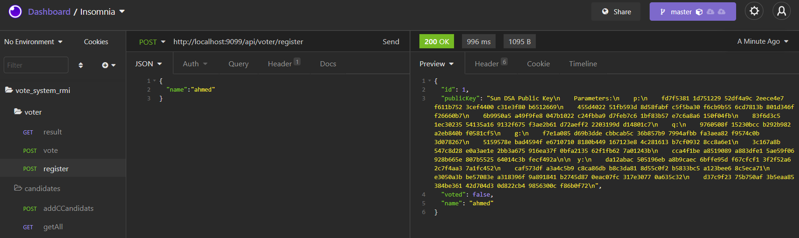

# e-voting_system

Le but du projet est mettre en ouvre le principe de la signature digitale qui permet d'authentifier de manière fiable l'utilisateur.
pour cree u systeme de vote.
Le projet est une rest api cree par spring boot et rmi.

## Table des matières
1. [La signature numérique](#sin)  
    a. [KeyPairGenerator ](#KeyPairGenerator)  
    b. [Signature  ](#Signature )  
    c. [verification ](#verification)  
2. [Tester le système](#test)

## 1. La signature numérique
 #### La signature numérique ou digitale - digital signature  est une technique de validation mathématique de l’authenticité
 et de l’intégrité d’un message, d’un logiciel ou d’un document électronique.
 
 ### a. KeyPairGenerator
#### generate KeyPair (public key ,private Key ) par L'algorithm DSA Digital Signature Algorithm.
  
 ### a. Signature
 #### La classe Java Signature (java.security.Signature) peut créer une signature numérique pour les données binaires.        Une signature numérique est un condensé de messages cryptés avec une clé privée d’une paire de clés privées / publiques.
  #### Toute personne en possession de la clé publique peut vérifier la signature numérique.
  
 ### a. verification
 #### vérification la signature numérique par le public key.

## 2. Tester le système
## Register Methode 

## Vote Methode 

